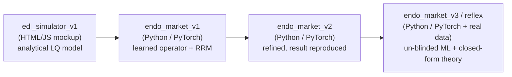

# REFLEX

**Reflexive Equilibrium Fixed-point Learning for endogenous financial markets.**

A machine learning framework for markets where the data distribution is not
fixed, but is generated by the model itself. In OTC corporate bond markets,
a dealer's quoting policy reshapes future trade flow, spreads, and liquidity,
breaking the standard ML assumption that the data-generating process is
independent of the learner.

REFLEX reframes learning as solving for a **self-consistent equilibrium**: a
fixed point where the market dynamics induced by a trading policy are stable
under repeated interaction with that same policy.

## Tech Stack

<!--- ML / scientific computing --->

<b>AI / ML & Scientific Computing:</b>

  
  
  
  
  
  
  

<!--- Language, config & testing --->

<b>Language, Config & Testing:</b>

  
  
  

<!--- Tooling & docs --->

<b>Tooling & Docs:</b>

  
  
  
  
  
  
  

<!--- Initial prototype (edl_simulator_v1) --->

<b>Initial Prototype (edl_simulator_v1):</b>

  
  
  
  

## What it does
- **Endogenous Distribution Learning:** replaces exogenous data `D_{t+1} = P(·|D_t)`
  with a policy-dependent system `D_{t+1} = T(D_t, π_θ)`.
- **Learned market response operator** `T_θ`: a differentiable, trainable
  operator over stochastic market transitions, replacing hand-built simulators.
- **Fixed-point objective:** solve `(π*, D*) = argmin_π E_D[R(π)] s.t. D = T(D, π)`.
- **Stability-aware training:** penalizes distribution collapse, liquidity
  fragmentation, and instability under self-induced market adaptation.
- **Implicit liquidity modeling:** treats liquidity as a latent dynamical field
  induced by interaction, not an observed variable.

## Core research question
Characterize **when the policy/market loop converges to a stable equilibrium
vs. fails to converge**, as a function of how adversarial the market is.

## Model lineage

Four generations of the same idea, *an endogenous market whose stability is
governed by a single feedback parameter*, each more structural than the last:

|                       | **edl_simulator_v1** | **endo_market_v1** | **endo_market_v2** | **endo_market_v3 (`reflex`)** |
|-----------------------|----------------------|-----------------|--------------------|-------------------------------|
| **Role**              | Earliest prototype   | Legacy iteration | Superseded | **Current** |
| **Implementation**    | HTML/JS browser mockup | Python (PyTorch, CPU) | Python (PyTorch, CPU) | Python (PyTorch + pandas, CPU), real-data calibrated |
| **Market model**      | Analytical linear-quadratic OTC bond | Structural multi-bond simulator (uninformed + toxic flow) | Structural OTC simulator + latent liquidity field | Same + genuine `N`-dealer shared informed pool |
| **Learner**           | Closed-form fixed point | Learned operator `T_θ` + RRM loop | Same, refined | **Un-blinded `T_θ`** (windowed fit learns `dD/dφ`) + PerfGD-corrected loops (analytic & learned) |
| **Control parameter** | Adversarialness `α`  | Adversariality `α ∈ [0,1]` | Feedback gain `ε` (`α` found to be confounded) | `ε`, dealer count `N`, universe size `d`, market regime |
| **Stability law**     | Stable iff `α < α_c = 1`; rate `α^t` | `m = K·α`, boundary `α* = 1/K` | `m ≈ εβ/γ`, boundary `ε < γ/β` | Closed-form `ε < γ/β`, `ε < γ/(N_eff·β)`, `ρ(M) < 1` - predicted a-priori, then verified |
| **Headline status**   | Validated at `α = 0.45` | Scaffolding done; **`α*` result not reproduced** | **Result reproduced**: `m` crosses 1 at `ε* ≈ 1.3`, then saturates | Theory+ML+data unified; **real-data fragility index** (headroom collapses 4×+ calm→crisis, peaks at Lehman & COVID) |
| **Tests / artifacts** | Sample run screenshot | 18 unit tests | 63 tests + phase-diagram PNG & sweep CSV | **110 tests** + 9 experiments (21 artifacts; smoke-verified 8/8) |

The progression: `edl_simulator_v1` proved the *concept* (one parameter flips a
market between convergence and chaos) analytically; `endo_market_v1` rebuilt it as a
learned-operator performative-prediction loop but couldn't cleanly tune the
transition; `endo_market_v2` identified `ε` (not `α`) as the clean control and
reproduced the `ε < γ/β` stability boundary; `endo_market_v3` unifies the ML,
the five closed-form theory results, and the real-data calibration in one
self-contained package (`reflex`) - and un-blinds the learned operator so the
loop that theory says must diverge can be stabilised, analytically *and* by
learning.

## Repository layout

    REFLEX/
    |- README.md                    ← this file
    |- CLAUDE.md                    ← orientation and conventions for AI coding agents
    |- endo_market_v3/              ← CURRENT: the self-contained `reflex` package (see Experiments)
    |  |- README.md                 ← methodology, the five pillars, quickstart, honest caveats
    |  |- theory/                   ← the five derivations (shipped copies) + code map
    |  |- data/                     ← calibration CSVs + daily master panel (provenance notes)
    |  |- configs/                  ← default | smoke | sweep specs
    |  |- reflex/                   ← the package: env (incl. N-dealer), policy (+GLFT baseline),
    |  |                              operator (un-blinded T_θ), theory (1.1–1.5), equilibrium
    |  |                              (3-mode loops + joint loop), estimators (ε triangulation),
    |  |                              calibration, objective, analysis (incl. fragility), utils
    |  |- experiments/              ← 9 entry points incl. run_all --profile smoke|full
    |  |- outputs/                  ← CSVs + PNGs (21 artifacts from the verified smoke suite)
    |  \- tests/                    ← 110 tests (103 fast + 7 slow)
    |- literature/                  ← two curated literature collections
    |  |- literature-vignesh/       ← 10 foundational papers + reading map (PDFs downloaded)
    |  \- literature-raghav/        ← same core + 8 extension papers + research roadmap
    |- new-methodology/             ← research roadmap, canonical math derivations + data pipeline
    |  |- README.md                 ← full methodology write-up and the To-Do checklist
    |  |- math-theory/              ← canonical derivations 1.1–1.5 (.md + .tex + PDFs)
    |  |- data_collection/          ← real macro + bond-factor dataset (raw/processed/master) + verification
    |  |- preprocessing/            ← cleaning, calibration fit (A,k), episode splits
    |  \- simulator|experiments|results/ ← placeholders (live code sits in endo_market_v3/)
    |- endo_market_v2/              ← superseded second generation (result absorbed into v3)
    |- endo_market_v1/              ← earliest Python iteration (formerly endo_market/)
    \- edl_simulator_v1/            ← earliest prototype (HTML/JS mockup)

## Experiments

### `REFLEX/endo_market_v3` (the `reflex` package): the current experiment suite

A dealer's quoting policy `φ` induces the data distribution `D(φ)`: tighter
quotes summon more informed ("toxic") flow that picks the dealer off. Under
**repeated retraining (RRM)**, when does the policy↔distribution loop converge
vs. diverge - and can the loop be *stabilised* by un-blinding it, analytically
(closed-form PerfGD) or by learning (`dD/dφ` learned by the operator)?

Nine experiments (`python -m experiments.run_all --profile smoke|full`):

| Experiment | What it shows | Theory |
|---|---|---|
| `run_fragility` | **Real-data headline:** the daily 1990–2026 fragility index - stability headroom `ε*(t)` collapses ~4× (IG) / ~13× (HY) calm→crisis, peaking at Lehman (2008-10-06) and the March-2020 freeze | 1.1 on data |
| `run_calibrated` | A-priori boundary per (rating × regime) from fitted `(A, k, σ, h)` | 1.1 + data |
| `run_sweep` | Predict-then-verify phase diagram: analytic `m_pred(ε)` overlay + measured median/IQR + robust bands | 1.1 + 1.4 |
| `run_perfgd` | Blind RRM diverges past `ε*`; PerfGD-analytic and PerfGD-learned converge; echo-chamber gap scan; the learned-vs-analytic toxic-slope seam | 1.2 |
| `run_dealers` | `(N, ε)` systemic surface `m_N = N_eff·m₁`; genuine shared-pool market probes | 1.3 |
| `run_universe` | `ρ(M)` at 128 correlated bonds via `O(d·k²)` Woodbury; truncation bound verified | 1.5 |
| `run_triangulation` | Three independent `ε` estimators (BR-slope / Sinkhorn / CKS) vs the closed form | 1.1 |
| `run_single` | One outer loop in any mode with seam diagnostics | - |

**Verified state:** 110 tests pass; the smoke suite runs 8/8 end to end
(21 artifacts in `endo_market_v3/outputs/` - the fragility index, calibrated
boundaries and universe scaling are full-fidelity closed-form results; the ML
artifacts are smoke-grade until the `--profile full` runs land).

See [`endo_market_v3/README.md`](endo_market_v3/README.md) for methodology,
layout, install/run and honest caveats.

### Prior generation (`endo_market_v2`, superseded - result absorbed into v3)

**v2's headline result** (reproduced, now also *predicted* by v3's closed
forms): sweeping the performative-feedback gain `ε`
(`clients.toxicity_feedback`), the best-response contraction modulus `m`
crosses the stability boundary `m = 1` near `ε* ≈ 1.3`, reproducing the
theoretical `ε < γ/β` condition (Perdomo et al., ICML 2020):

| ε    | 0.0  | 2.0   | 3.0   | 4.0   | 6.0   | 8.0  |
|-----:|-----:|------:|------:|------:|------:|-----:|
| median modulus `m` | 0.51 | 1.25 | 1.27 | 1.25 | 1.26 | 1.60 |
| fraction unstable  | 0%   | 100% | 100% | 100% | 100% | 67%  |

  

*The v2 phase diagram: modulus `m` against the feedback gain `ε`, crossing the
stability boundary `m = 1`.*

## Literature

`REFLEX/literature/` holds **two curated collections** at the intersection of
**performative prediction / decision-dependent stochastic optimization** and
**optimal OTC market making**. Each paper maps to a specific component of the
codebase and points at a concrete extension.

- **`literature-vignesh/`**: the original **10 foundational papers** and the
  reading map that ties each one to a piece of the codebase (the RRM loop, the
  operator `T_θ`, the BR-slope modulus, the toxic-flow gate, inventory state,
  the scale-up caveats). PDFs are already downloaded under `pdfs/`.
- **`literature-raghav/`**: the same foundational core, expanded with deeper
  per-paper "critical reading notes" and a more opinionated research roadmap
  (specific theorems to prove, experiments to run, venues to target). Run its
  `download_pdfs.sh` to fetch the PDFs.

### Shared core (in both collections)

| # | Paper | Project component |
|---|-------|-------------------|
| 1 | Perdomo et al., *Performative Prediction* (ICML 2020) | `ε < γ/β` boundary; RRM loop |
| 2 | Mendler-Dünner et al., *Stochastic Optimization for PP* (NeurIPS 2020) | Effective convexity `γ − εβ` |
| 3 | Miller et al., *Outside the Echo Chamber* (ICML 2021) | Stable≠optimal gap; defensive widening |
| 4 | Izzo et al., *Performative Gradient Descent* (ICML 2021) | Fixing operator blind to `dD/dφ` |
| 5 | Drusvyatskiy & Xiao, *Decision-Dependent Distributions* (MOR 2023) | Rigorous convergence; vanishing-bias view |
| 6 | Jagadeesan et al., *Regret Minimization w/ Performative Feedback* (ICML 2022) | Making `ε` explorable |
| 7 | Li & Wai, *State-Dependent Performative Prediction* (AISTATS 2022) | Inventory carryover `q_after` |
| 8 | Guéant, Lehalle, Fernández-Tapia, *Inventory Risk* (2013) | `exp(−decay·h)` intensity; deriving `γ` |
| 9 | Bergault & Guéant, *Size Matters for OTC MMs* (2021) | Scale to 100+ bonds; factor reduction |
| 10 | Barzykin, Bergault, Guéant, Lemmel, *Adverse Selection & Price Reading* (arXiv 2025) | Toxic-flow channel from first principles |

**The throughline:** Perdomo's theorem (#1) says repeated retraining converges
iff `ε < γ/β`. Papers #2-#7 sharpen, generalize, and make that loop stateful
and explorable; papers #8-#10 supply the market-microstructure control theory
that lets `γ`, `β`, and the toxic slope be *derived* from first principles
rather than tuned. `endo_market_v2` is the bridge that realizes #1 structurally
inside an OTC bond market.

`literature-raghav/` additionally carries deeper per-paper "critical reading
notes" and a more opinionated research roadmap. See that folder's `README.md`
for the full discussion.

Full per-paper notes and BibTeX live in each collection's `README.md` and
`references.bib`. PDFs land in each collection's `pdfs/` after running its
`download_pdfs.sh`.

## Analytic stability theory (`new-methodology/`)

Where the simulator *measures* the stability boundary by sweeping, the
[`new-methodology/math-theory/`](new-methodology/math-theory/) program **derives it
in closed form** from the simulator's own microstructure primitives - then verifies
each derivation against the code. All five priorities are **derived *and*
implemented** as dependency-light closed-form modules - authoritative versions in
[`endo_market_v3/reflex/theory/`](endo_market_v3/reflex/theory/) (originals frozen
in `endo_market_v2`), each with tests:

| # | Result | Key object | Novelty |
|---|--------|-----------|---------|
| **1.1** | Analytic boundary | `m = εβ/γ`, stable iff `ε < γ/β` | `γ`, `β`, `ε` are *computed* from GLFT fill-curve curvature + the toxic-flow slope `dτ/dh`, not treated as tuned Lipschitz constants - an *a-priori* boundary you can evaluate before running the loop. |
| **1.2** | PerfGD un-blinding | `Δ = −β(h−ψ)ε`, `γ_PO` | The distribution response `dD/dφ` is supplied in *closed form* (no estimation), so the corrected loop is governed by the objective curvature `γ_PO` and converges where blind RRM diverges - past the boundary `ε*`. |
| **1.3** | Multi-dealer systemic risk | `ε < γ/(N_eff·β)`, `N_c = 1/m₁` | A shared toxic pool makes competition a *synchronised common-mode cobweb*: the market destabilises a factor `N_eff` **before** any single dealer would - competition manufactures systemic fragility. |
| **1.4** | Robust boundary | `ε̂_n + δ_n < γ/β`, `δ_n = O(1/√n)` | The parametric `1/√n` radius is *bought by the common-random-numbers probe* (a naive difference gives only `n^{−1/3}`); the crossing is statistically hard to pin (`n_req = O(Δ^{−2})`), separating statistical from structural uncertainty. |
| **1.5** | Factor-model scaling | modulus matrix `M = βΓ⁻¹E`, `ρ(M)<1` | The curse of dimensionality is defused by the *same* factor structure that causes it - `Γ` is diagonal-plus-low-rank, so `ρ(M)` is `O(d·k²)` via Woodbury with a truncation error linear in the residual factor variance `λ_{k+1}(C)`. |

**The novelty in one line.** Performative-prediction theory (Perdomo et al., ICML
2020) proves repeated retraining converges iff `ε < γ/β` but treats `γ`, `β`, `ε` as
abstract constants of an unspecified loss. REFLEX pins them to a *structural* OTC
market-making model and turns that single point boundary into a **predictive,
un-blindable, multi-dealer, statistically-robust, 100+-bond** one - every claim
stated as a closed form and made falsifiable against the simulator. See
[`new-methodology/README.md`](new-methodology/README.md) for the full methodology and
[`new-methodology/math-theory/`](new-methodology/math-theory/) for the derivations
(each with a compilable LaTeX companion) and the module-by-module code map.

## Data (real-market calibration)

[`new-methodology/data_collection/`](new-methodology/data_collection/) and
[`new-methodology/preprocessing/`](new-methodology/preprocessing/) hold a
**real, public, verified** dataset used to calibrate the simulator's
microstructure regime - ~36 years of daily and ~70 years of monthly series
joined into `REFLEX_MASTER_DATASET.csv`:

- **Macro / regime:** CBOE VIX (σ proxy, regime classifier), EIA WTI crude,
  Fed H.15 10-year Treasury (DV01), Shiller S&P 500 / CAPE, gold + BLS CPI.
- **Bond microstructure:** Dickerson–Mueller–Robotti (2023 JFE) TRACE-derived
  bond factors - the **liquidity risk factor** is the primary `ε` proxy - and
  monthly returns for **212 real-CUSIP** corporate bonds (the `D(φ)` proxy).
- **Preprocessing:** cleaning/winsorisation/ADF, reconstructed `(h, q, τ)`
  proxies, an exponential-intensity `λ(h)=A·e^{−k·h}` fit per rating×regime, and
  lookahead-safe calibration / validation / held-out episode splits.

**Honest provenance (stated in the paper, not a footnote):** this is *not*
trade-level TRACE - dealer-side prints, per-dealer inventory `q`, and per-bond
`A`/`k` require WRDS TRACE Enhanced (access pending), so those quantities are
proxied from the closest free sources. See
[`data_collection/docs/REJECTED_SOURCES.md`](new-methodology/data_collection/docs/REJECTED_SOURCES.md).

`endo_market_v3` **ships copies** of the artifacts it consumes
([`endo_market_v3/data/`](endo_market_v3/data/)) so the package is
self-contained; regenerate everything from public sources with the pipeline's
four scripts.

## Status & next steps

Theory (1.1–1.5) **derived + coded**; the ML **un-blinded and integrated** with
the math (`endo_market_v3`); real-data calibration wired in; all nine
experiments verified end to end (110 tests, smoke suite 8/8). The remaining
program, in order:

1. **Paper-grade runs** - `python -m experiments.run_all --profile full` in
   `endo_market_v3/` (hours of CPU): the ε-sweep phase diagram
   (predicted-vs-measured crossing + robust bands), three-mode PerfGD loops,
   dealer probes, measured calibrated boundaries, more seeds for median + IQR.
   The fragility index, calibrated a-priori boundaries and universe scaling
   are already full-fidelity (closed forms on real data).
2. **Analyze** - curate figures and raw data into
   [`new-methodology/results/`](new-methodology/results/).
3. **Write the paper** - conference-ready for [ICAIF 2026](https://icaif2026.org/)
   (ACM `sigconf`, 8 pages, double-blind; deadline Aug 2, 2026).

## Goals

The research program targets one novelty claim: derive the performativity
stability boundary analytically from microstructure primitives instead of
sweeping it by hand. In priority order (full checklist in
[`new-methodology/README.md`](new-methodology/README.md#to-do)):

- [x] **Analytic boundary (P1):** derive `γ`, `β`, and the toxic slope `dτ/dh` in closed form (GLFT/Avellaneda-Stoikov + Barzykin adverse selection). *Derived + coded* ([`reflex/theory/analytic_boundary.py`](endo_market_v3/reflex/theory/analytic_boundary.py)); the three-way `ε` triangulation (BR-slope / Sinkhorn / CKS) is *built and smoke-verified* ([`reflex/estimators/`](endo_market_v3/reflex/estimators/)).
- [x] **Un-blind the operator (P2):** PerfGD-corrected loop using the analytic `dD/dφ` **and** the learned `dD/dφ` (windowed operator + live summary). *Derived + coded* ([`reflex/theory/perfgd.py`](endo_market_v3/reflex/theory/perfgd.py), [`reflex/equilibrium/loops.py`](endo_market_v3/reflex/equilibrium/loops.py)).
- [x] **Multi-dealer / systemic risk (P3):** `N`-dealer PSNE boundary `ε < γ/(N_eff·β)`, mean-field limit, **and a genuine `N`-dealer simulated market**. *Derived + coded* ([`reflex/theory/multi_dealer.py`](endo_market_v3/reflex/theory/multi_dealer.py), [`reflex/env/multi_dealer.py`](endo_market_v3/reflex/env/multi_dealer.py)).
- [x] **Robust uncertainty (P4):** distributionally robust `ε*` with an ambiguity radius shrinking at `O(1/√n)`; robust bands wired into every sweep. *Derived + coded* ([`reflex/theory/robust.py`](endo_market_v3/reflex/theory/robust.py)).
- [x] **Scale and calibrate (P5):** 100+ correlated bonds via factor-model reduction (`ρ(M)<1`, `O(d·k²)` Woodbury) with data-calibrated per-bond σ; regime-calibrated microstructure from the real dataset. *Derived + coded* ([`reflex/theory/factor_scaling.py`](endo_market_v3/reflex/theory/factor_scaling.py), [`reflex/calibration/`](endo_market_v3/reflex/calibration/)); trade-level TRACE calibration remains pending WRDS access.
- [ ] Paper-grade full-profile runs → curated results (`new-methodology/results/`).
- [ ] Secure a research placement at a top AI lab (with affiliation).
- [ ] Submit to [ICAIF 2026](https://icaif2026.org/) (ACM Intl. Conference on AI in Finance; deadline Aug 2, 2026) or another main-track venue.

See the [To-Do section of `new-methodology/README.md`](new-methodology/README.md#to-do)
for the full task breakdown across math, data, preprocessing, architecture,
training, and ICAIF submission requirements.
