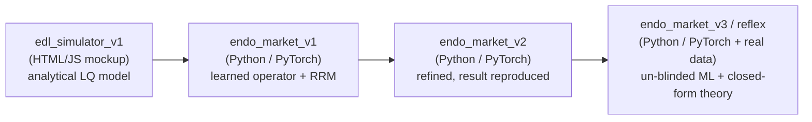

# REFLEX

**Reflexive Equilibrium Fixed-point Learning for endogenous financial markets.**

A machine learning framework for markets where the data distribution is not
fixed, but is generated by the model itself. In OTC corporate bond markets,
a dealer's quoting policy reshapes future trade flow, spreads, and liquidity,
breaking the standard ML assumption that the data-generating process is
independent of the learner.

REFLEX reframes learning as solving for a **self-consistent equilibrium**: a
fixed point where the market dynamics induced by a trading policy are stable
under repeated interaction with that same policy.

*Built by Vignesh Nagarajan and Shriraghav Ashok.*

## Tech Stack

<!--- ML / scientific computing --->

<b>AI / ML & Scientific Computing:</b>

  
  
  
  
  
  
  

<!--- Language, config & testing --->

<b>Language, Config & Testing:</b>

  
  
  

<!--- Tooling & docs --->

<b>Tooling & Docs:</b>

  
  
  
  
  
  
  

<!--- Initial prototype (edl_simulator_v1) --->

<b>Initial Prototype (edl_simulator_v1):</b>

  
  
  
  

## Functionality

- **Endogenous Distribution Learning:** replaces exogenous data `D_{t+1} = P(·|D_t)`
  with a policy-dependent system `D_{t+1} = T(D_t, π_θ)`.
- **Learned market response operator** `T_θ`: a differentiable, trainable
  operator over stochastic market transitions, replacing hand-built simulators.
- **Fixed-point objective:** solve `(π*, D*) = argmin_π E_D[R(π)] s.t. D = T(D, π)`.
- **Stability-aware training:** penalizes distribution collapse, liquidity
  fragmentation, and instability under self-induced market adaptation.
- **Implicit liquidity modeling:** treats liquidity as a latent dynamical field
  induced by interaction, not an observed variable.

## Model lineage

Four generations of the same idea, *an endogenous market whose stability is
governed by a single feedback parameter*, each more structural than the last:

|                       | **edl_simulator_v1** | **endo_market_v1** | **endo_market_v2** | **endo_market_v3 (`reflex`)** |
|-----------------------|----------------------|-----------------|--------------------|-------------------------------|
| **Role**              | Earliest prototype   | Legacy iteration | Superseded | **Current** |
| **Implementation**    | HTML/JS browser mockup | Python (PyTorch, CPU) | Python (PyTorch, CPU) | Python (PyTorch + pandas, CPU), real-data calibrated |
| **Market model**      | Analytical linear-quadratic OTC bond | Structural multi-bond simulator (uninformed + toxic flow) | Structural OTC simulator + latent liquidity field | Same + genuine `N`-dealer shared informed pool |
| **Learner**           | Closed-form fixed point | Learned operator `T_θ` + RRM loop | Same, refined | **Un-blinded `T_θ`** (windowed fit learns `dD/dφ`) + PerfGD-corrected loops (analytic & learned) |
| **Control parameter** | Adversarialness `α`  | Adversariality `α ∈ [0,1]` | Feedback gain `ε` (`α` found to be confounded) | `ε`, dealer count `N`, universe size `d`, market regime |
| **Stability law**     | Stable iff `α < α_c = 1`; rate `α^t` | `m = K·α`, boundary `α* = 1/K` | `m ≈ εβ/γ`, boundary `ε < γ/β` | Closed-form `ε < γ/β`, `ε < γ/(N_eff·β)`, `ρ(M) < 1` - predicted a-priori, then verified |
| **Headline status**   | Validated at `α = 0.45` | Scaffolding done; **`α*` result not reproduced** | Result reproduced (measured crossing later shown protocol-inflated; see its README) | Theory+ML+data unified; **real-data fragility index** (headroom collapses ~4.4× calm→crisis, HY >10× below IG, plateauing through the GFC & COVID) |
| **Tests / artifacts** | Sample run screenshot | 18 unit tests | 63 tests + phase-diagram PNG & sweep CSV | **110 tests** + 9 experiments, **full-profile verified 8/8** (curated in `research/results/`) |

The progression: `edl_simulator_v1` proved the *concept* (one parameter flips a
market between convergence and chaos) analytically; `endo_market_v1` rebuilt it as a
learned-operator performative-prediction loop but couldn't cleanly tune the
transition; `endo_market_v2` identified `ε` (not `α`) as the clean control and
reproduced the `ε < γ/β` stability boundary; `endo_market_v3` unifies the ML,
the five closed-form theory results, and the real-data calibration in one
self-contained package (`reflex`) - and un-blinds the learned operator so the
loop that theory says must diverge can be stabilised in closed form
(loop-level stabilisation *by learning* remains a documented open gap; see
`research/analysis/`).

## Repository layout

    REFLEX/
    |- README.md                    ← this file
    |- CLAUDE.md                    ← orientation and conventions for AI coding agents
    |- LICENSE                      ← Apache License 2.0
    |- endo_market_v3/              ← CURRENT: the self-contained `reflex` package (see Experiments)
    |  |- README.md                 ← methodology, the five pillars, quickstart, honest caveats
    |  |- theory/                   ← the five derivations (shipped copies) + code map
    |  |- data/                     ← calibration CSVs + daily master panel (provenance notes)
    |  |- configs/                  ← default | smoke | sweep specs
    |  |- reflex/                   ← the package: env (incl. N-dealer), policy (+GLFT baseline),
    |  |                              operator (un-blinded T_θ), theory (1.1–1.5), equilibrium
    |  |                              (3-mode loops + joint loop), estimators (ε triangulation),
    |  |                              calibration, objective, analysis (incl. fragility), utils
    |  |- experiments/              ← 9 entry points incl. run_all --profile smoke|full
    |  |- outputs/                  ← CSVs + PNGs from the latest full-profile run
    |  \- tests/                    ← 110 tests (103 fast + 7 slow)
    |- literature/                  ← two curated literature collections
    |  |- literature-vignesh/       ← 10 foundational papers + reading map (PDFs downloaded)
    |  \- literature-raghav/        ← same core + 8 extension papers + research roadmap
    |- research/                    ← the research program around endo_market_v3: theory, data, runs, analyses
    |  |- README.md                 ← full methodology write-up and the To-Do checklist
    |  |- math-theory/              ← canonical derivations 1.1–1.5 (.md + .tex + PDFs)
    |  |- data_collection/          ← real macro + bond-factor dataset (raw/processed/master) + verification
    |  |- preprocessing/            ← cleaning, calibration fit (A,k), episode splits
    |  |- results/                  ← executed paper-grade runs (07-10-2026: artifacts + REPORT)
    |  \- analysis/                 ← written analyses of those runs (tables, figures, breakdowns)
    |- endo_market_v2/              ← superseded second generation (result absorbed into v3)
    |- endo_market_v1/              ← earliest Python iteration (formerly endo_market/)
    \- edl_simulator_v1/            ← earliest prototype (HTML/JS mockup)

## Experiments

A dealer's quoting policy `φ` induces the data distribution `D(φ)`: tighter
quotes summon more informed ("toxic") flow that picks the dealer off. Under
**repeated retraining (RRM)**, when does the policy↔distribution loop converge
vs. diverge - and can the loop be *stabilised* by un-blinding it, analytically
(closed-form PerfGD) or by learning (`dD/dφ` learned by the operator)?

### Executive summary of endo_market_v3's results (paper-grade run, July 10, 2026)

The full-profile suite ran 8/8 in ~10 min CPU after a measurement-layer audit
fixed six probe/protocol defects; every number below is from the curated run
in [`research/results/07-10-2026/`](research/results/07-10-2026/) (complete
illustrated report:
[`REPORT.md`](research/results/07-10-2026/REPORT.md)).

- **Real-data fragility (1.1 on 36 years of data):** the closed-form
  stability headroom `ε* = γ/β` collapses **~4.4× (IG) / ~4.3× (HY)** from
  calm to crisis, HY sits **>10× below IG** in every regime, and the modulus
  at observed spreads *falls* into crisis (0.85 → 0.14): defensive widening,
  live on real data. The index saturates at a crisis plateau through the GFC
  and the COVID freeze (degenerate crisis fit, flagged).
- **Predict-then-verify (1.1 + 1.4):** under the clean probe protocol the
  measured modulus tracks the closed form within ~10–25% in the contracting
  regime (0.39 vs 0.43 at `ε = 2`), and the measured boundary crossing
  (`ε* ≈ 3.17`) sits left of the a-priori prediction (4.70) by almost exactly
  the realized-state correction (~2.8–3.0) that the triangulation measures
  independently. The robust certificates grade the grid
  stable → undecided → unstable exactly as the seed bands warrant.
- **Systemic risk on a genuine multi-dealer market (1.3):** common-mode
  amplification **1.74× / 3.16×** vs the predicted `N_eff` = 2 / 3, with the
  differential mode dead at full spillover: competition destabilises the
  market a factor `N_eff` before any single dealer would.
- **Three-way `ε` triangulation (1.1 §9):** the Sinkhorn and CKS legs agree
  with each other within 14% and bracket the realized-state closed form at
  2.3–2.7×, with the liquidity-inflation channel (realized `ρ ≈ 2.3` vs the
  a-priori 1.0) identified as the dominant correction.
- **Factor scaling (1.5):** `ρ(M) ≈ 0.50` flat from 8 to 128 bonds on
  data-calibrated per-bond dispersion; the truncation bound holds with orders
  of magnitude of slack; 0.07 s at `d = 128` via Woodbury.
- **PerfGD un-blinding (1.2):** verified in closed form (the blind cobweb
  diverges in the genuinely unstable regime while the corrected 1-D ascent
  converges to `h_PO`; echo-chamber gaps `O(ε)`/`O(ε²)` confirmed). The
  *learned* loop does not yet reproduce the stabilisation - an honestly
  documented open gap with the mechanism identified via the ML↔math seam
  diagnostics.
- **The `α` confound (appendix):** the adversariality sweep shows its full
  non-monotone hump (0.08 → 1.83 → 0.67), the quantitative case for the
  feedback gain `ε` as the headline control variable.

<table>
  <tr>
    <td width="50%" align="center">
       
      <b>The real-data headline:</b> daily stability headroom on 36 years of market data, plateauing through the GFC and COVID
    </td>
    <td width="50%" align="center">
       
      <b>Predict then verify:</b> measured modulus (median + IQR + robust bands) vs the closed form at the probe spread
    </td>
  </tr>
  <tr>
    <td width="50%" align="center">
       
      <b>Competition manufactures fragility:</b> measured common-mode moduli vs the predicted N_eff amplification
    </td>
    <td width="50%" align="center">
       
      <b>Beyond the boundary (closed form):</b> the blind cobweb fails to settle while corrected PerfGD converges to h_PO
    </td>
  </tr>
</table>

### The nine experiments

Run everything with `python -m experiments.run_all --profile smoke|full`
(full profile: ~10-15 min CPU, deterministic from `(config, seed)`):

| Experiment | What it shows | Theory |
|---|---|---|
| `run_fragility` | The daily 1990–2026 fragility index on real data | 1.1 on data |
| `run_calibrated` | A-priori boundary per (rating × regime) from fitted `(A, k, σ, h)` | 1.1 + data |
| `run_sweep` | Predict-then-verify phase diagram: analytic overlay + measured median/IQR + robust bands | 1.1 + 1.4 |
| `run_perfgd` | Closed-form beyond-boundary demo + echo-chamber gaps + the three-mode ML seam diagnostic | 1.2 |
| `run_dealers` | `(N, ε)` systemic surface `m_N = N_eff·m₁`; genuine shared-pool market probes | 1.3 |
| `run_universe` | `ρ(M)` at 128 correlated bonds via `O(d·k²)` Woodbury; truncation bound verified | 1.5 |
| `run_triangulation` | Three independent `ε` estimators (BR-slope / Sinkhorn / CKS) vs the closed form | 1.1 |
| `run_single` | One outer loop in any mode with seam diagnostics | - |

See [`endo_market_v3/README.md`](endo_market_v3/README.md) for methodology,
layout, install/run and honest caveats. Prior generations: `endo_market_v2`'s
historical headline result (and its post-audit correction) lives in
[`endo_market_v2/README.md`](endo_market_v2/README.md).

## Literature

`REFLEX/literature/` holds **two curated collections** at the intersection of
**performative prediction / decision-dependent stochastic optimization** and
**optimal OTC market making**. Each paper maps to a specific component of the
codebase and points at a concrete extension.

- **`literature-vignesh/`**: the original **10 foundational papers** and the
  reading map that ties each one to a piece of the codebase (the RRM loop, the
  operator `T_θ`, the BR-slope modulus, the toxic-flow gate, inventory state,
  the scale-up caveats). PDFs are already downloaded under `pdfs/`.
- **`literature-raghav/`**: the same foundational core, expanded with deeper
  per-paper "critical reading notes" and a more opinionated research roadmap
  (specific theorems to prove, experiments to run, venues to target). Run its
  `download_pdfs.sh` to fetch the PDFs.

**The throughline:** Perdomo et al.'s performative-prediction theorem says
repeated retraining converges iff `ε < γ/β`. The optimization literature
sharpens that loop, makes it stateful, and makes `ε` explorable; the
market-microstructure control theory (Guéant-Lehalle-Fernández-Tapia,
Bergault-Guéant, Barzykin et al.) supplies the structure that lets `γ`, `β`,
and the toxic slope be *derived* from first principles rather than tuned.
REFLEX is the bridge that realizes the theorem structurally inside an OTC
bond market. Full per-paper notes and BibTeX live in each collection's
`README.md` and `references.bib`.

## Analytic stability theory (`research/`)

Where the simulator *measures* the stability boundary by sweeping, the
[`research/math-theory/`](research/math-theory/) program **derives it
in closed form** from the simulator's own microstructure primitives - then verifies
each derivation against the code. All five priorities are **derived *and*
implemented** as dependency-light closed-form modules - authoritative versions in
[`endo_market_v3/reflex/theory/`](endo_market_v3/reflex/theory/) (originals frozen
in `endo_market_v2`), each with tests:

| # | Result | Key object | Novelty |
|---|--------|-----------|---------|
| **1.1** | Analytic boundary | `m = εβ/γ`, stable iff `ε < γ/β` | `γ`, `β`, `ε` are *computed* from GLFT fill-curve curvature + the toxic-flow slope `dτ/dh`, not treated as tuned Lipschitz constants - an *a-priori* boundary you can evaluate before running the loop. |
| **1.2** | PerfGD un-blinding | `Δ = −β(h−ψ)ε`, `γ_PO` | The distribution response `dD/dφ` is supplied in *closed form* (no estimation), so the corrected loop is governed by the objective curvature `γ_PO` and converges where blind RRM diverges - past the boundary `ε*`. |
| **1.3** | Multi-dealer systemic risk | `ε < γ/(N_eff·β)`, `N_c = 1/m₁` | A shared toxic pool makes competition a *synchronised common-mode cobweb*: the market destabilises a factor `N_eff` **before** any single dealer would - competition manufactures systemic fragility. |
| **1.4** | Robust boundary | `ε̂_n + δ_n < γ/β`, `δ_n = O(1/√n)` | The parametric `1/√n` radius is *bought by the common-random-numbers probe* (a naive difference gives only `n^{−1/3}`); the crossing is statistically hard to pin (`n_req = O(Δ^{−2})`), separating statistical from structural uncertainty. |
| **1.5** | Factor-model scaling | modulus matrix `M = βΓ⁻¹E`, `ρ(M)<1` | The curse of dimensionality is defused by the *same* factor structure that causes it - `Γ` is diagonal-plus-low-rank, so `ρ(M)` is `O(d·k²)` via Woodbury with a truncation error linear in the residual factor variance `λ_{k+1}(C)`. |

**The novelty in one line.** Performative-prediction theory (Perdomo et al., ICML
2020) proves repeated retraining converges iff `ε < γ/β` but treats `γ`, `β`, `ε` as
abstract constants of an unspecified loss. REFLEX pins them to a *structural* OTC
market-making model and turns that single point boundary into a **predictive,
un-blindable, multi-dealer, statistically-robust, 100+-bond** one - every claim
stated as a closed form and made falsifiable against the simulator. See
[`research/README.md`](research/README.md) for the full methodology and
[`research/math-theory/`](research/math-theory/) for the derivations
(each with a compilable LaTeX companion) and the module-by-module code map.

## Data (real-market calibration)

[`research/data_collection/`](research/data_collection/) and
[`research/preprocessing/`](research/preprocessing/) hold a
**real, public, verified** dataset used to calibrate the simulator's
microstructure regime - ~36 years of daily and ~70 years of monthly series
joined into `REFLEX_MASTER_DATASET.csv`:

- **Macro / regime:** CBOE VIX (σ proxy, regime classifier), EIA WTI crude,
  Fed H.15 10-year Treasury (DV01), Shiller S&P 500 / CAPE, gold + BLS CPI.
- **Bond microstructure:** Dickerson–Mueller–Robotti (2023 JFE) TRACE-derived
  bond factors - the **liquidity risk factor** is the primary `ε` proxy - and
  monthly returns for **212 real-CUSIP** corporate bonds (the `D(φ)` proxy).
- **Preprocessing:** cleaning/winsorisation/ADF, reconstructed `(h, q, τ)`
  proxies, an exponential-intensity `λ(h)=A·e^{−k·h}` fit per rating×regime, and
  lookahead-safe calibration / validation / held-out episode splits.

**Honest provenance (stated in the paper, not a footnote):** this is *not*
trade-level TRACE - dealer-side prints, per-dealer inventory `q`, and per-bond
`A`/`k` require WRDS TRACE Enhanced (access pending), so those quantities are
proxied from the closest free sources. See
[`data_collection/docs/REJECTED_SOURCES.md`](research/data_collection/docs/REJECTED_SOURCES.md).

`endo_market_v3` **ships copies** of the artifacts it consumes
([`endo_market_v3/data/`](endo_market_v3/data/)) so the package is
self-contained; regenerate everything from public sources with the pipeline's
four scripts.

## Docs

Every document in the project and where it lives:

| Document | What it covers |
|----------|----------------|
| [`README.md`](README.md) | This file: the project overview |
| [`CLAUDE.md`](CLAUDE.md) | Orientation and conventions for AI coding agents (layout, gotchas, build/test/run) |
| [`endo_market_v3/README.md`](endo_market_v3/README.md) | The current package: methodology, the five pillars, quickstart, honest caveats |
| [`endo_market_v3/theory/README.md`](endo_market_v3/theory/README.md) | Code map from the five derivations to `reflex.theory` (+ shipped derivation copies) |
| [`endo_market_v3/data/README.md`](endo_market_v3/data/README.md) | Provenance of the shipped calibration artifacts |
| [`research/README.md`](research/README.md) | The full research-program methodology and the To-Do checklist (incl. ICAIF requirements) |
| [`research/math-theory/README.md`](research/math-theory/README.md) | The five canonical derivations 1.1–1.5 (each `.md` + compilable `.tex` + PDF) |
| [`research/data_collection/README.md`](research/data_collection/README.md) | Dataset sources and construction; `docs/` holds `DATA_CATALOGUE.md`, `VERIFICATION_LOG.md`, `REJECTED_SOURCES.md` |
| [`research/preprocessing/README.md`](research/preprocessing/README.md) | Cleaning, enrichment, intensity fits, episode splits |
| [`research/results/README.md`](research/results/README.md) | Conventions for the dated run folders |
| [`research/results/07-10-2026/REPORT.md`](research/results/07-10-2026/REPORT.md) | **The complete illustrated report** of the paper-grade run (all figures + findings) |
| [`research/results/07-10-2026/README.md`](research/results/07-10-2026/README.md) | Run provenance: commands, commit, timings, environment (+ per-experiment `notes.md`) |
| [`research/analysis/README.md`](research/analysis/README.md) | Index of the analysis layer |
| [`research/analysis/ANALYSIS-full-2026-07.md`](research/analysis/ANALYSIS-full-2026-07.md) | The master per-experiment analysis: tables, breakdowns, limitations |
| [`research/analysis/pre-run-audit-2026-07.md`](research/analysis/pre-run-audit-2026-07.md) | The measurement-layer audit: six defects, root causes, fixes, reframings |
| [`literature/literature-vignesh/README.md`](literature/literature-vignesh/README.md) | 10 foundational papers, reading map, per-paper notes (+ `references.bib`) |
| [`literature/literature-raghav/README.md`](literature/literature-raghav/README.md) | 18 papers with critical reading notes + research roadmap (+ `references.bib`) |
| [`endo_market_v2/README.md`](endo_market_v2/README.md) | The superseded second generation: mechanism, historical headline result + post-audit note |
| [`endo_market_v1/README.md`](endo_market_v1/README.md) | The legacy first Python iteration |
| [`edl_simulator_v1/README.md`](edl_simulator_v1/README.md) | The earliest analytical prototype (HTML/JS) |

## Status and next steps

The research program targets one novelty claim: derive the performativity
stability boundary analytically from microstructure primitives instead of
sweeping it by hand.

**Where things stand (July 2026):** theory (1.1–1.5) derived + coded; the ML
un-blinded and integrated with the math; real-data calibration wired in; the
measurement layer audited against the theory (six probe/protocol defects
found and fixed; 110/110 tests); the paper-grade full-profile suite executed
(8/8, ~10 min CPU) and curated + analyzed in
[`research/results/07-10-2026/`](research/results/07-10-2026/) and
[`research/analysis/`](research/analysis/).

- [x] **Analytic boundary (P1):** `γ`, `β`, `dτ/dh` in closed form ([`reflex/theory/analytic_boundary.py`](endo_market_v3/reflex/theory/analytic_boundary.py)); the three-way `ε` triangulation built and verified against the realized-state closed form ([`reflex/estimators/`](endo_market_v3/reflex/estimators/)).
- [x] **Un-blind the operator (P2):** PerfGD-corrected loops with the analytic **and** learned `dD/dφ` ([`reflex/theory/perfgd.py`](endo_market_v3/reflex/theory/perfgd.py), [`reflex/equilibrium/loops.py`](endo_market_v3/reflex/equilibrium/loops.py)); closed form verified, loop-level stabilisation an open gap.
- [x] **Multi-dealer / systemic risk (P3):** PSNE boundary `ε < γ/(N_eff·β)`, mean-field limit, and a genuine `N`-dealer market with amplification verified ([`reflex/theory/multi_dealer.py`](endo_market_v3/reflex/theory/multi_dealer.py), [`reflex/env/multi_dealer.py`](endo_market_v3/reflex/env/multi_dealer.py)).
- [x] **Robust uncertainty (P4):** robust `ε*` with `O(1/√n)` radius; bands + certificates on every sweep ([`reflex/theory/robust.py`](endo_market_v3/reflex/theory/robust.py)).
- [x] **Scale and calibrate (P5):** 128 correlated bonds via `O(d·k²)` Woodbury with data-calibrated per-bond σ; regime-calibrated microstructure ([`reflex/theory/factor_scaling.py`](endo_market_v3/reflex/theory/factor_scaling.py), [`reflex/calibration/`](endo_market_v3/reflex/calibration/)); trade-level TRACE calibration pending WRDS access.
- [x] **Paper-grade full-profile runs → curated results:** executed July 10, 2026 after the measurement-layer audit; artifacts + [`REPORT.md`](research/results/07-10-2026/REPORT.md) in [`research/results/07-10-2026/`](research/results/07-10-2026/), analysis in [`research/analysis/`](research/analysis/).
- [ ] **Write the ICAIF 2026 paper** (ACM `sigconf`, 8 pages, double-blind; deadline Aug 2, 2026). Scoping is settled in the analysis: closed forms + real-data fragility + probe-level verifications are the headline; loop-level PerfGD stabilisation is reported as a diagnosed open gap, not a claim.
- [ ] **(Stretch) close the loop-level gap:** make the corrected *learned* loop find `h_PO` (operator architectures anchored to the GLFT structural form; bias-compensating corrections; stability-penalty regularisation against the echo-chamber collapse).
- [ ] Secure a research placement at a top AI lab (with affiliation).
- [ ] Submit to [ICAIF 2026](https://icaif2026.org/) (ACM Intl. Conference on AI in Finance) or another main-track venue.

Full task breakdown across math, data, preprocessing, architecture, training,
and ICAIF submission requirements: the
[To-Do section of `research/README.md`](research/README.md#to-do).

## License

Licensed under the [Apache License 2.0](LICENSE): free to use, modify, and
distribute with attribution and notice of changes.
