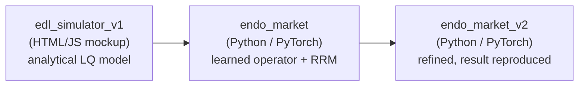
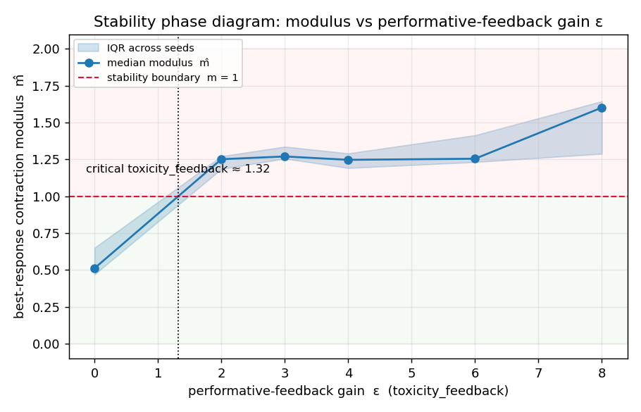
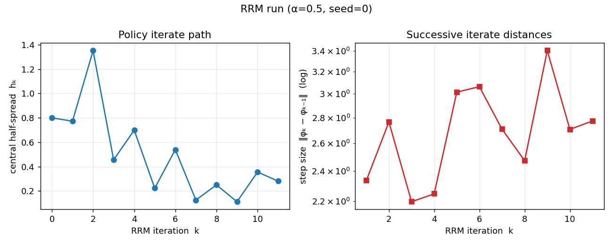

# REFLEX

**Reflexive Equilibrium Fixed-point Learning for endogenous financial markets.**

A machine learning framework for markets where the data distribution is not
fixed, but is generated by the model itself. In OTC corporate bond markets,
a dealer's quoting policy reshapes future trade flow, spreads, and liquidity,
breaking the standard ML assumption that the data-generating process is
independent of the learner.

REFLEX reframes learning as solving for a **self-consistent equilibrium**: a
fixed point where the market dynamics induced by a trading policy are stable
under repeated interaction with that same policy.

## Tech Stack

<!--- ML / scientific computing --->

<b>AI / ML & Scientific Computing:</b>

  
  
  
  
  
  
  

<!--- Language, config & testing --->

<b>Language, Config & Testing:</b>

  
  
  

<!--- Tooling & docs --->

<b>Tooling & Docs:</b>

  
  
  
  
  
  
  

<!--- Initial prototype (edl_simulator_v1) --->

<b>Initial Prototype (edl_simulator_v1):</b>

  
  
  
  

## What it does
- **Endogenous Distribution Learning:** replaces exogenous data `D_{t+1} = P(·|D_t)`
  with a policy-dependent system `D_{t+1} = T(D_t, π_θ)`.
- **Learned market response operator** `T_θ`: a differentiable, trainable
  operator over stochastic market transitions, replacing hand-built simulators.
- **Fixed-point objective:** solve `(π*, D*) = argmin_π E_D[R(π)] s.t. D = T(D, π)`.
- **Stability-aware training:** penalizes distribution collapse, liquidity
  fragmentation, and instability under self-induced market adaptation.
- **Implicit liquidity modeling:** treats liquidity as a latent dynamical field
  induced by interaction, not an observed variable.

## Core research question
Characterize **when the policy/market loop converges to a stable equilibrium
vs. fails to converge**, as a function of how adversarial the market is.

## Model lineage

Three generations of the same idea, *an endogenous market whose stability is
governed by a single feedback parameter*, each more structural than the last:

|                       | **edl_simulator_v1** | **endo_market** | **endo_market_v2** |
|-----------------------|----------------------|-----------------|--------------------|
| **Role**              | Earliest prototype   | Legacy iteration | **Current** |
| **Implementation**    | HTML/JS browser mockup | Python (PyTorch, CPU) | Python (PyTorch, CPU) |
| **Market model**      | Analytical linear-quadratic OTC bond | Structural multi-bond simulator (uninformed + toxic flow) | Structural OTC simulator + latent liquidity field |
| **Learner**           | Closed-form fixed point | Learned operator `T_θ` + RRM loop | Same, refined |
| **Control parameter** | Adversarialness `α`  | Adversariality `α ∈ [0,1]` | Feedback gain `ε` (`α` found to be confounded) |
| **Stability law**     | Stable iff `α < α_c = 1`; rate `α^t` | `m = K·α`, boundary `α* = 1/K` | `m ≈ εβ/γ`, boundary `ε < γ/β` |
| **Headline status**   | Validated at `α = 0.45` | Scaffolding done; **`α*` result not reproduced** | **Result reproduced**: `m` crosses 1 at `ε* ≈ 1.3`, then saturates |
| **Tests / artifacts** | Sample run screenshot | 18 unit tests | 21 tests + phase-diagram PNG & sweep CSV |

The progression: `edl_simulator_v1` proved the *concept* (one parameter flips a
market between convergence and chaos) analytically; `endo_market` rebuilt it as a
learned-operator performative-prediction loop but couldn't cleanly tune the
transition; `endo_market_v2` identified `ε` (not `α`) as the clean control and
reproduced the `ε < γ/β` stability boundary.

## Repository layout

    REFLEX/
    |- README.md                    ← this file
    |- CLAUDE.md                    ← orientation and conventions for AI coding agents
    |- literature/                  ← two curated literature collections
    |  |- literature-vignesh/       ← Vignesh's set: 10 foundational papers + reading map
    |  |  |- README.md              ← reading map and per-paper notes (10 papers)
    |  |  |- references.bib         ← BibTeX for the 10 papers
    |  |  |- download_pdfs.sh       ← fetches the 10 open-access PDFs from arXiv
    |  |  \- pdfs/                  ← PDFs land here after running download_pdfs.sh
    |  \- literature-raghav/        ← Raghav's set: same core papers + deeper critical notes
    |     |- README.md              ← expanded reading map, critical notes, research roadmap
    |     |- references.bib         ← BibTeX
    |     \- download_pdfs.sh       ← fetches the open-access PDFs into pdfs/
    |- endo_market_v2/              ← current experiment (see Experiments below)
    |  |- README.md                 ← full methodology, headline results, caveats
    |  |- configs/                  ← default.yaml | sweep_feedback.yaml | sweep_adversariality.yaml
    |  |- endo_market/              ← core library (env, policy, operator, equilibrium, analysis)
    |  |- experiments/              ← run_single.py | run_sweep.py
    |  |- outputs/                  ← phase diagram PNG + sweep CSV written here
    |  \- tests/                    ← 21 tests (20 fast + 1 slow end-to-end)
    |- new-methodology/             ← forward-looking research roadmap (methodology + To-Do)
    |  |- README.md                 ← full methodology write-up and the To-Do checklist
    |  |- math-theory/              ← proofs & derivations (1.1 boundary + 1.2 PerfGD: DONE)
    |  |- simulator/                ← (placeholder) operator, multi-dealer, estimators
    |  |- experiments/              ← (placeholder) sweeps and phase diagrams
    |  \- results/                  ← (placeholder) figures and tables
    |- endo_market/                 ← earlier Python iteration (superseded by endo_market_v2)
    \- edl_simulator_v1/            ← earliest prototype (HTML/JS mockup)

## Experiments

### `REFLEX/endo_market_v2`: Performative Prediction in an Endogenous OTC Bond Market

The current main experiment. A dealer's quoting policy `φ` induces the data
distribution `D(φ)`: tighter quotes summon more informed ("toxic") flow that
picks the dealer off. Under **repeated retraining (RRM)**, when does the
policy↔distribution loop converge vs. diverge?

**Headline result:** sweeping the performative-feedback gain `ε`
(`clients.toxicity_feedback` config knob), the best-response contraction
modulus `m` crosses the stability boundary `m = 1` near `ε* ≈ 1.3`,
reproducing the theoretical `ε < γ/β` condition from performative-prediction
theory (Perdomo et al., ICML 2020):

| ε    | 0.0  | 2.0   | 3.0   | 4.0   | 6.0   | 8.0  |
|-----:|-----:|------:|------:|------:|------:|-----:|
| median modulus `m` | 0.51 | 1.25 | 1.27 | 1.25 | 1.26 | 1.60 |
| fraction unstable  | 0%   | 100% | 100% | 100% | 100% | 67%  |

### Results

  

*The phase diagram: modulus `m` against the feedback gain `ε`, crossing the
stability boundary `m = 1`.*

  

*A representative RRM iterate trajectory in the unstable regime (`α = 0.5`,
`ε = 5.0`), showing the loop failing to settle to a fixed point.*

Raw sweep data is in
`endo_market_v2/outputs/sweep_toxicity_feedback_results.csv`.

See `REFLEX/endo_market_v2/README.md` for the full mechanism write-up,
methodology, locked P&L identity, honest caveats, and install/run instructions.

## Literature

`REFLEX/literature/` holds **two curated collections** at the intersection of
**performative prediction / decision-dependent stochastic optimization** and
**optimal OTC market making**. Each paper maps to a specific component of the
codebase and points at a concrete extension.

- **`literature-vignesh/`**: the original **10 foundational papers** and the
  reading map that ties each one to a piece of the codebase (the RRM loop, the
  operator `T_θ`, the BR-slope modulus, the toxic-flow gate, inventory state,
  the scale-up caveats). PDFs are already downloaded under `pdfs/`.
- **`literature-raghav/`**: the same foundational core, expanded with deeper
  per-paper "critical reading notes" and a more opinionated research roadmap
  (specific theorems to prove, experiments to run, venues to target). Run its
  `download_pdfs.sh` to fetch the PDFs.

### Shared core (in both collections)

| # | Paper | Project component |
|---|-------|-------------------|
| 1 | Perdomo et al., *Performative Prediction* (ICML 2020) | `ε < γ/β` boundary; RRM loop |
| 2 | Mendler-Dünner et al., *Stochastic Optimization for PP* (NeurIPS 2020) | Effective convexity `γ − εβ` |
| 3 | Miller et al., *Outside the Echo Chamber* (ICML 2021) | Stable≠optimal gap; defensive widening |
| 4 | Izzo et al., *Performative Gradient Descent* (ICML 2021) | Fixing operator blind to `dD/dφ` |
| 5 | Drusvyatskiy & Xiao, *Decision-Dependent Distributions* (MOR 2023) | Rigorous convergence; vanishing-bias view |
| 6 | Jagadeesan et al., *Regret Minimization w/ Performative Feedback* (ICML 2022) | Making `ε` explorable |
| 7 | Li & Wai, *State-Dependent Performative Prediction* (AISTATS 2022) | Inventory carryover `q_after` |
| 8 | Guéant, Lehalle, Fernández-Tapia, *Inventory Risk* (2013) | `exp(−decay·h)` intensity; deriving `γ` |
| 9 | Bergault & Guéant, *Size Matters for OTC MMs* (2021) | Scale to 100+ bonds; factor reduction |
| 10 | Barzykin, Bergault, Guéant, Lemmel, *Adverse Selection & Price Reading* (arXiv 2025) | Toxic-flow channel from first principles |

**The throughline:** Perdomo's theorem (#1) says repeated retraining converges
iff `ε < γ/β`. Papers #2-#7 sharpen, generalize, and make that loop stateful
and explorable; papers #8-#10 supply the market-microstructure control theory
that lets `γ`, `β`, and the toxic slope be *derived* from first principles
rather than tuned. `endo_market_v2` is the bridge that realizes #1 structurally
inside an OTC bond market.

`literature-raghav/` additionally carries deeper per-paper "critical reading
notes" and a more opinionated research roadmap. See that folder's `README.md`
for the full discussion.

Full per-paper notes and BibTeX live in each collection's `README.md` and
`references.bib`. PDFs land in each collection's `pdfs/` after running its
`download_pdfs.sh`.

## Goals

The research program targets one novelty claim: derive the performativity
stability boundary analytically from microstructure primitives instead of
sweeping it by hand. In priority order (full checklist in
[`new-methodology/README.md`](new-methodology/README.md#to-do)):

- [x] **Analytic boundary (P1):** derive `γ`, `β`, and the toxic slope `dτ/dh` in closed form (GLFT/Avellaneda-Stoikov + Barzykin adverse selection), then triangulate `ε` three ways (BR-slope, Sinkhorn/Wasserstein, CKS informed-flow).
- [ ] **Un-blind the operator (P2):** PerfGD-corrected loop using the analytic `dD/dφ`; measure the echo-chamber (stable-vs-optimal) gap.
- [ ] **Multi-dealer / systemic risk (P3):** `N`-dealer PSNE boundary `ε < γ/(N·β)` and its mean-field (`N → ∞`) limit.
- [ ] **Robust uncertainty (P4):** distributionally robust `ε*` with an ambiguity radius shrinking at `O(1/√n)`.
- [ ] **Scale and calibrate (P5):** 100+ correlated bonds via factor-model reduction, calibrated to TRACE-derived or synthetic microstructure.
- [ ] Secure a research placement at a top AI lab (with affiliation).
- [ ] Submit to [ICAIF 2026](https://icaif2026.org/) (ACM Intl. Conference on AI in Finance; deadline Aug 2, 2026) or another main-track venue.

See the [To-Do section of `new-methodology/README.md`](new-methodology/README.md#to-do)
for the full task breakdown across math, data, preprocessing, architecture,
training, and ICAIF submission requirements.
