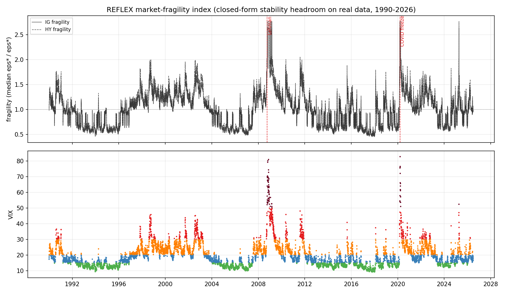
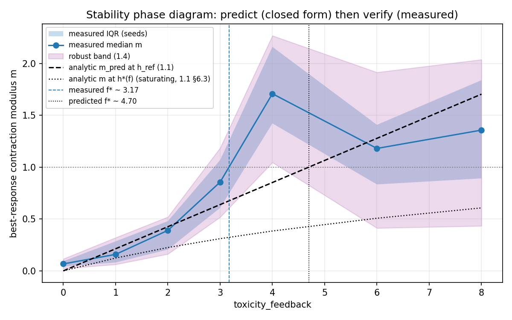
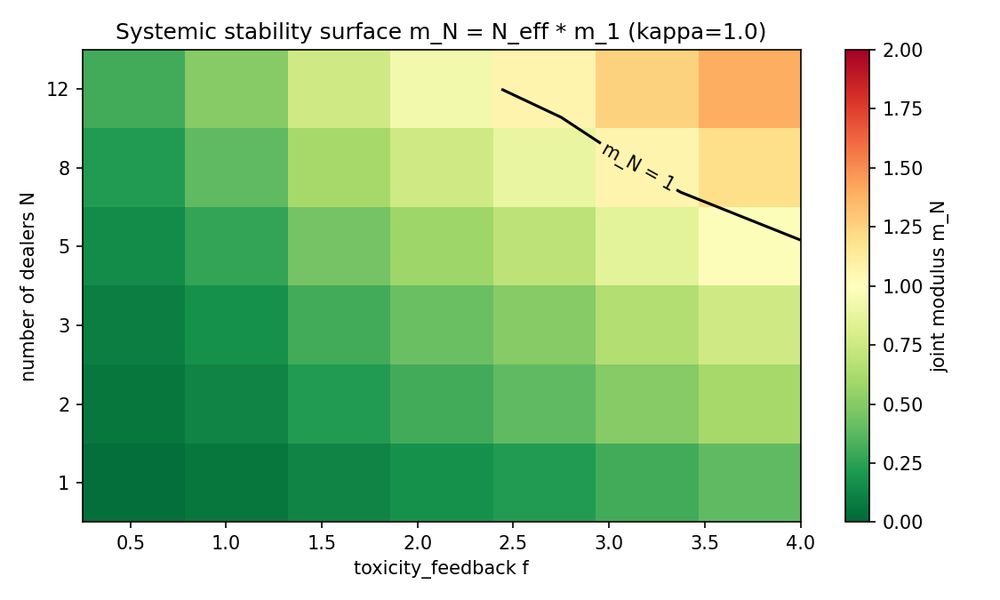
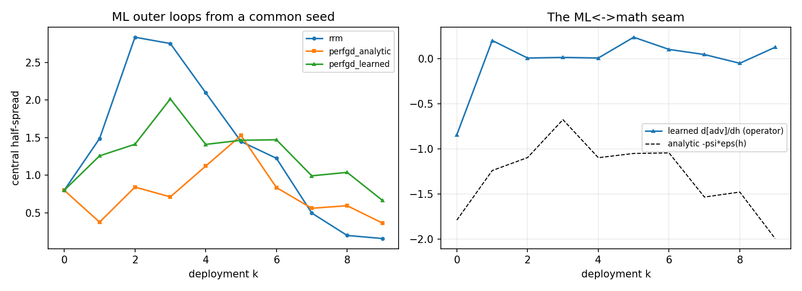
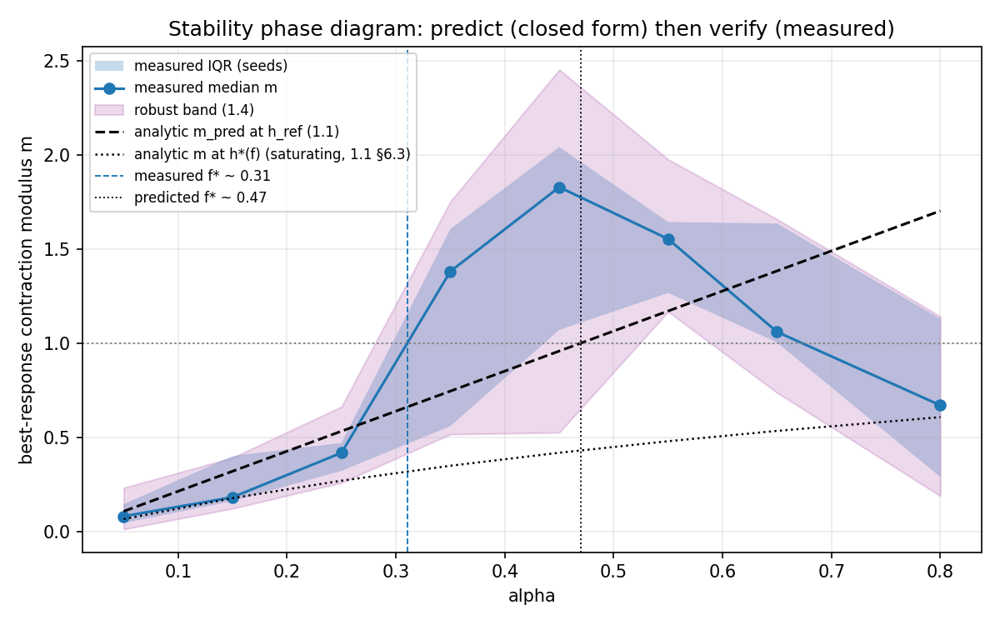
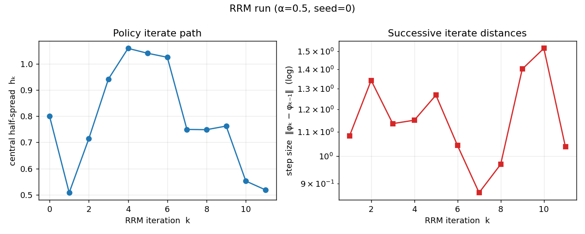

# REFLEX paper-grade run report - July 10, 2026

The complete illustrated report of the full-profile experiment suite executed
against the shipped real-data calibrations. One page, every generated figure,
all headline numbers, and the honest caveats. Raw artifacts live beside this
file (per-experiment subfolders); the extended per-experiment analysis is
[`../../analysis/ANALYSIS-full-2026-07.md`](../../analysis/ANALYSIS-full-2026-07.md)
and the pre-run audit record is
[`../../analysis/pre-run-audit-2026-07.md`](../../analysis/pre-run-audit-2026-07.md).

| | |
|---|---|
| **Run date** | July 10, 2026 |
| **Producing code** | commit `815425d` (post-audit measurement layer); sweeps rerun under the clean probe protocol (`collection_jitter = 0.05`) |
| **Commands** | `python -u -m experiments.run_all --profile full`, then the feedback and alpha sweeps via `experiments.run_sweep` |
| **Outcome** | suite **8/8 passed in 9.1 min CPU**; clean sweeps ~4 + ~3 min; **110/110 tests green** before and after |
| **Environment** | Python 3.9.13, torch 2.8.0+cpu, numpy 2.0.2, pandas 2.3.3; Windows 11, CPU only; deterministic from `(config, seed)` |

---

## 1. Executive summary

1. **The stability boundary is computable a priori from real data and behaves
   sensibly**: the closed-form headroom `eps* = gamma/beta` collapses ~4.4x
   (IG) / ~4.3x (HY) from calm to crisis, and HY sits more than 10x below IG
   in every regime (section 2).
2. **Defensive widening is visible in real data**: the modulus at observed
   spreads falls into crisis (IG 0.85 -> 0.14); dealers widen faster than the
   toxic channel steepens (sections 2, 3).
3. **Predict-then-verify works quantitatively under the clean probe
   protocol**: the measured modulus tracks the closed form within ~10-25% in
   the contracting regime, and the measured boundary crossing (f* ~ 3.17)
   sits left of the a-priori prediction (4.70) by almost exactly the
   realized-state correction measured independently by the triangulation
   (section 4).
4. **Competition amplifies performative instability as derived**: genuine
   shared-pool market probes give common-mode amplification 1.74x / 3.16x vs
   the predicted N_eff = 2 / 3, with the differential mode dead at full
   spillover (section 5).
5. **The three-way epsilon triangulation brackets the realized-state closed
   form** at the factor ~2-3 level, with the liquidity-inflation channel
   (realized rho ~ 2.3 vs the a-priori 1.0) identified as the dominant
   correction (section 6).
6. **Factor scaling defuses the curse of dimensionality**: rho(M) ~ 0.50 flat
   from 8 to 128 bonds on data-calibrated dispersion; the truncation bound
   holds with orders of magnitude of slack (section 7).
7. **The un-blinding corrections are proven in closed form but do not yet
   stabilise the learned loop**: the honest negative result, reproduced at
   paper scale, with the mechanism identified via the ML/math seam
   diagnostics (section 8).
8. **The alpha sweep is confounded exactly as theory predicts**, now showing
   its full non-monotone hump (section 9).

---

## 2. Market-fragility index (real data, 1990-2026)

The theory 1.1 closed forms evaluated on every trading day of the master
panel (VIX spine, per-regime intensity fits), for IG and HY. Closed form on
real data: full fidelity by construction.

| regime | IG eps* | HY eps* | IG modulus at observed h | IG fragility |
|--------|--------:|--------:|-------------------------:|-------------:|
| calm     | 1207.7 | 93.5 | 0.847 | 0.60 |
| normal   |  739.2 | 61.3 | 0.870 | 0.98 |
| elevated |  594.4 | 45.9 | 0.520 | 1.22 |
| stress   |  477.3 | 35.6 | 0.223 | 1.52 |
| crisis   |  275.9 | 21.8 | 0.139 | 2.64 |

- Headroom collapses **~4.4x (IG)** and **~4.3x (HY)** calm -> crisis. The
  previously quoted "~13x (HY)" does not reproduce on the audited pipeline;
  the larger effect is the *level* gap: HY has >10x less headroom than IG in
  every regime.
- The modulus at observed spreads **falls** into crisis: defensive widening,
  live on real data.
- The index **saturates at a crisis plateau** rather than peaking on a single
  day (the crisis intensity fit is degenerate, k = 0, n = 74 days). The GFC
  window (first crisis day 2008-10-06) and the COVID freeze (2020-03-09) sit
  on the same plateau; intra-crisis ranking is not identified.

**Caveats.** VIX-implied spreads and proxy-level intensity fits (not
trade-level TRACE); regime ordering is data-driven, absolute levels are not.

---

## 3. Calibrated a-priori boundaries per (rating x regime)

| cell | h_obs | h* | eps* | m(h*) | m_pred at h_obs | m_measured (median, 3 seeds) |
|------|------:|----:|-----:|------:|----------------:|------------------------------:|
| IG calm     | 0.374 | 0.436 | 465.3 | 0.066 | 0.080 | 0.000 |
| IG normal   | 0.477 | 0.558 | 268.0 | 0.066 | 0.081 | 0.000 |
| IG elevated | 0.683 | 0.794 | 147.3 | 0.066 | 0.080 | 0.038 |
| IG stress   | 1.051 | 1.207 |  70.6 | 0.067 | 0.080 | 1.631 |
| IG crisis   | 1.233 | 1.472 |  34.5 | 0.065 | (degenerate) | - |
| HY calm     | 1.030 | 1.183 |  28.3 | 0.067 | - | - |
| HY normal   | 1.331 | 1.535 |  16.2 | 0.066 | - | - |
| HY elevated | 1.882 | 2.159 |   9.1 | 0.066 | - | - |
| HY stress   | 2.896 | 3.275 |   4.7 | 0.066 | - | - |
| HY crisis   | 3.493 | 4.169 |   2.2 | 0.055 | - | - |

- The fixed-point modulus is regime-invariant (~0.066) by the
  anchor-stiffness construction; **the regime story lives entirely in the
  headroom eps*** (465 -> 2.2 across the table), consistent with the
  fragility index.
- The measured column is a weak consistency check, not a result: at IG
  calm/normal the anchor weight (~190) pins the probe below its resolution
  floor (reads exactly 0), at IG stress probe noise dominates a 3-seed
  median. Only IG elevated (0.038 vs predicted 0.080, the documented
  finite-budget attenuation factor ~2) is informative.

---

## 4. Phase-diagram sweep: predict then verify (7 gains x 8 seeds)

The headline experiment, run under the **clean probe protocol**
(`collection_jitter = 0.05`; the first execution inherited 0.2, which
inflated every reading ~3x and produced a spurious m ~ 0.66 at zero
feedback - audit section 1.6; these artifacts are the clean rerun).

| f | median m | IQR | robust verdict | m_pred at h_ref | m at h*(f) |
|---|---------:|-----|----------------|----------------:|-----------:|
| 0 | 0.067 | [0.04, 0.09] | stable    | 0.000 | 0.000 |
| 1 | 0.159 | [0.08, 0.28] | stable    | 0.213 | 0.124 |
| 2 | 0.390 | [0.21, 0.48] | stable    | 0.426 | 0.225 |
| 3 | 0.856 | [0.61, 1.07] | undecided | 0.639 | 0.310 |
| 4 | 1.707 | [1.42, 2.16] | **unstable** | 0.852 | 0.384 |
| 6 | 1.180 | [0.83, 1.41] | undecided | 1.277 | 0.507 |
| 8 | 1.357 | [0.89, 1.84] | undecided | 1.703 | 0.607 |

Measured crossing: **f* ~ 3.17**. Predicted at the probe spread (a-priori
state): **f* ~ 4.70**. Predicted at the realized state (the rho ~ 2.3
liquidity-inflation correction measured by the triangulation): **~2.8-3.0**,
bracketing the measurement.

- In the contracting regime the probe tracks the closed form quantitatively
  (0.390 vs 0.426 at f = 2, an 8% agreement).
- Past the boundary the probe stops being a local slope: IQRs explode and
  seed-level readings bifurcate, exactly the theory's own A4 caveat. The
  robust certificates respond correctly: stable through f = 2, unstable at
  f = 4, undecided where the beyond-boundary readings scatter.
- The fixed-point curve never crosses 1 (saturates at 0.61 by f = 8):
  defensive widening (theory 1.1 section 6.3). The measured instability is a
  statement about the retraining map at the operating spread, not about the
  self-consistent equilibrium.

**Budget sensitivity** (the lazy-deploy K study): in the contracting regime
the measured modulus is budget-insensitive beyond ~30 inner steps and
matches the closed form; past the boundary it grows with budget and
bifurcates across seeds.

---

## 5. Multi-dealer systemic risk (genuine shared-pool market)

The analytic (N, f) surface, the simulated joint cobweb, and CRN joint-modulus
probes at the interior regime (f_probe = 0.5, liq_flow_boost / N), after the
audit fixed the environment's coupling to the derivation's sum form.

| N | measured common-mode | predicted N_eff x m_1 | measured differential | clipped |
|---|---------------------:|----------------------:|----------------------:|---------|
| 1 | 0.786 | 0.786 | - | no |
| 2 | 1.369 | 1.571 | 0.0034 | no |
| 3 | 2.480 | 2.357 | 0.0032 | no |

- Amplification ratios **1.74x (N = 2)** and **3.16x (N = 3)** vs the
  predicted N_eff = 2 and 3: within 13% and 5%.
- The differential mode is dead at full spillover (theory: (1 - kappa) m_1 =
  0): instability is purely common-mode, the synchronised systemic channel.
  Competition destabilises the market a factor N_eff before any single
  dealer would.

---

## 6. Three-way epsilon triangulation

Three independent instruments at the operating spread (h_ref = 1.0), against
the closed form evaluated at the a-priori A2 state and at the **realized
deployment state** (theory 1.1 section 9).

| quantity | epsilon | ratio vs realized closed form |
|----------|--------:|------------------------------:|
| analytic, a-priori A2 state (rho = 1) | 0.764 | 0.44x |
| **analytic, realized state** (rho = 2.32) | **1.726** | 1.00 |
| BR-slope leg (m_hat = 0.541) | 0.508 | 0.29x |
| Sinkhorn/W1 leg | 4.578 | 2.65x |
| CKS flow-curve leg | 4.011 | 2.32x |

- The realized-state correction is first order and its driver is identified:
  the deployment's own flow boosts the liquidity field to rho ~ 2.3.
- The two distribution-space legs agree with each other within 14% and sit
  2.3-2.7x above the realized-state closed form; the residual is the
  state-feedback channel that any frozen-state closed form omits. The closed
  form is a lower anchor, not an unbiased point prediction.
- The BR leg reads low (0.29x): the documented finite-budget attenuation of
  the decision-space map.

---

## 7. Universe factor scaling (8 to 128 bonds)

The d x d modulus matrix M = beta * Gamma^-1 * E with per-bond sigmas
dispersed by the data-calibrated coefficient of variation (per-bond vol CV =
1.32 across the 212 real CUSIPs, clipped at the structural band cap 0.8),
plus the O(d k^2) Woodbury reduction and the truncation bound.

| d | rho(M) | stable | scalar-max m | market alignment |
|---|-------:|--------|-------------:|-----------------:|
| 8   | 0.499 | yes | 0.502 | 0.213 |
| 16  | 0.501 | yes | 0.502 | ~1e-13 |
| 32  | 0.501 | yes | 0.502 | ~1e-13 |
| 64  | 0.501 | yes | 0.502 | ~1e-13 |
| 128 | 0.501 | yes | 0.502 | ~1e-13 |

- rho(M) is flat in universe size and pinned to the worst scalar modulus;
  the fragile mode is idiosyncratic, not the market factor. On this
  calibration, correlation does not manufacture cross-sectional instability.
- Truncation at d = 128: measured error < 2e-4 vs bounds 0.019-1.82; the
  worst-case bound holds with 3-4 orders of magnitude of slack. Runtime
  0.07 s at d = 128.

---

## 8. PerfGD: closed form verified, loop-level gap documented

Three layers: the closed-form gap scan, the exact 1-D dynamics in the
genuinely unstable regime, and the three ML loop modes from a common seed
(the ML/math seam diagnostic).

**Closed form (verified at full scale).** gamma_PO > 0 on the whole grid;
the echo-chamber decision gap grows ~O(eps) (0.08 -> 0.65) and the value gap
~O(eps^2) (0.002 -> 0.21). In the unstable demo regime (m_rrm = 1.21,
slow toxic decay): the blind cobweb does **not** converge; the corrected 1-D
ascent converges to h_PO. At the default microstructure no on-grid gain
destabilises the fixed point (saturation), and the run says so explicitly.

**ML loops (the honest negative result).** Central half-spread over 10
deployments in the unstable regime (h_PO = 1.64, seed 0):

| mode | trajectory (h per deployment) | final PR |
|------|-------------------------------|---------:|
| blind RRM        | 0.80 1.49 2.83 2.75 2.10 1.45 1.23 0.50 0.20 **0.16** | -1033 |
| PerfGD-analytic  | 0.80 0.38 0.84 0.71 1.12 1.53 0.84 0.56 0.60 **0.36** | -952 |
| PerfGD-learned   | 0.80 1.26 1.41 2.01 1.41 1.46 1.47 0.99 1.04 **0.66** | -493 |

No mode converges or operates near h_PO. The blind loop ends in the
echo-chamber collapse; the seam diagnostic shows why: the operator's learned
toxic slope starts right-signed (-0.84 vs analytic -1.79) and flips positive
by late deployments (the operator is fit on self-poisoned trajectories).
The analytic correction is faithful to theory 1.2, but locating h_PO
requires the operator's implied dJ/dh to match the structural objective's,
and the blind operator's does not. Scoped claim: un-blinding is proven in
closed form; at loop level with a learned operator it is an open problem
with an identified mechanism.

---

## 9. Appendix: the alpha-confound sweep

The same probe protocol over adversariality alpha in [0.05, 0.80] at fixed
f = 5: the documented confound, now with its full shape resolved.

| alpha | 0.05 | 0.15 | 0.25 | 0.35 | 0.45 | 0.55 | 0.65 | 0.80 |
|-------|-----:|-----:|-----:|-----:|-----:|-----:|-----:|-----:|
| median m | 0.08 | 0.18 | 0.42 | 1.38 | **1.83** | 1.55 | 1.06 | 0.67 |

The measured modulus **rises and then reverses**: it climbs with alpha
through ~0.45 (the feedback-slope channel), then falls back below 1 by
alpha = 0.8 as the dealer flees to wide spreads where the toxic response has
decayed (the operating-regime channel wins). A sweep whose measured boundary
depends on which side of the hump the grid samples is not a control
variable; this is the quantitative case for the feedback gain as the
headline axis.

---

## 10. Reference: one instrumented loop

A single perfgd_analytic loop at the default config (f = 5) with
per-iteration seam diagnostics; ends stable (probe m_hat = 0.54).

---

## 11. Methods note: the audit that preceded this run

This run is only quotable because six measurement-layer defects were found
and fixed first (full record:
[`../../analysis/pre-run-audit-2026-07.md`](../../analysis/pre-run-audit-2026-07.md)):
the multi-dealer environment's mean-normalised coupling (cancels the N_eff
amplification), probes railing at the spread cap (silent zeros), the
triangulation probing at the no-signal analytic fixed point (390x off),
the sweep overlay evaluated at a different spread than the measurement, a
dispersion-calibration no-op, and inflated collection jitter (~3x on every
CRN probe reading; the historical v2 crossing eps* ~ 1.3 was substantially
that artifact). The committed smoke artifacts contained these defective
numbers; smoke outputs prove the pipeline, never the science.

## 12. Limitations (paper-ready)

1. Not trade-level TRACE: VIX-implied spreads, proxy-level intensity fits,
   no per-dealer inventories. Regime ordering is data-driven; absolute
   critical gains are not. WRDS TRACE Enhanced is the upgrade path.
2. Crisis cells are degenerate (k = 0): crisis boundaries sit on the anchor
   floor; intra-crisis variation is not identified.
3. The toxic channel is structurally scaled (documented ratios), not
   data-identified.
4. At default-like constants the self-consistent fixed point never
   destabilises (defensive widening); measured crossings are statements
   about the local retraining map at the operating spread.
5. Measured moduli are protocol-dependent (optimizer budget, collection
   jitter); levels compare within a protocol, not across.
6. Loop-level PerfGD stabilisation is an open gap (section 8).
7. Sweep medians carry 8-seed IQRs and robust bands; the calibrated measured
   column (3 seeds) is a consistency check only.
